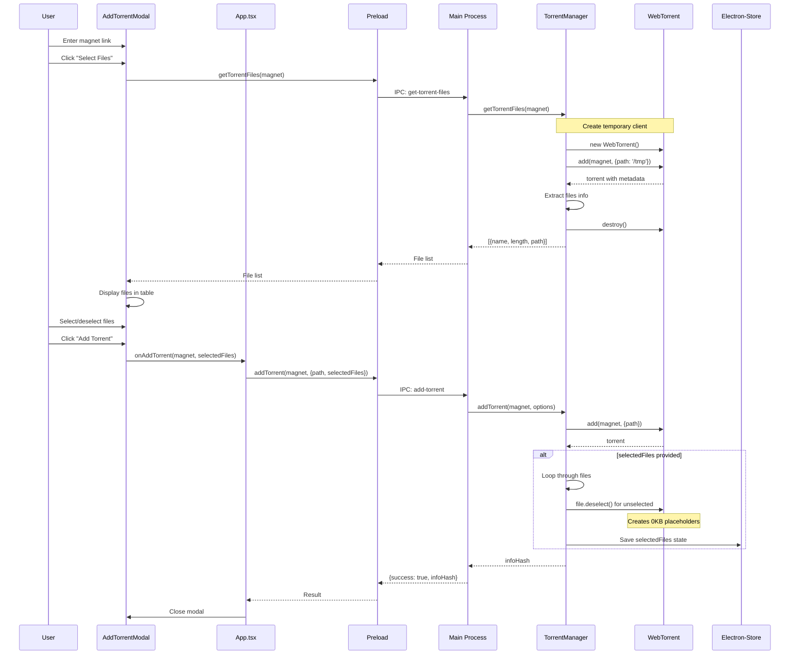
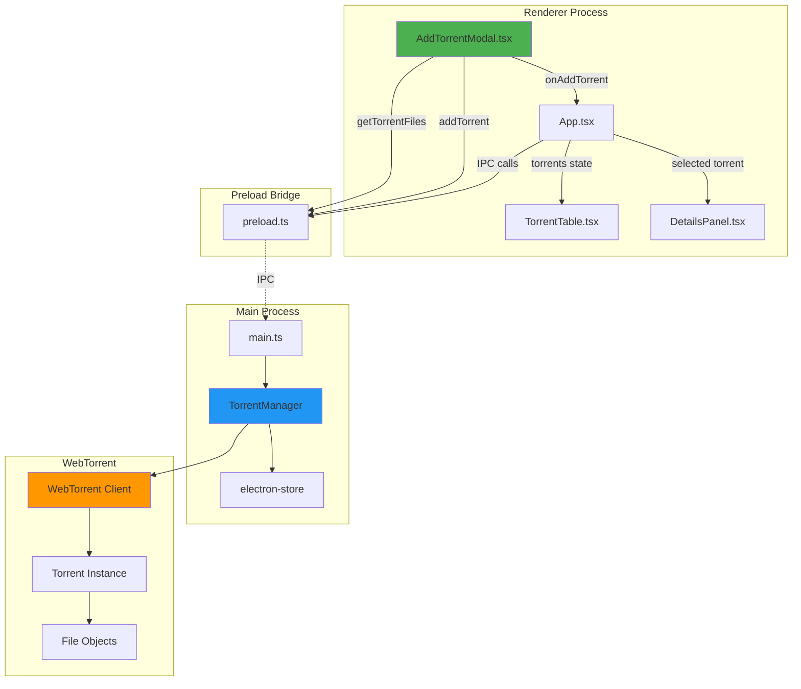
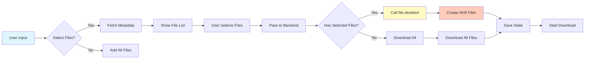
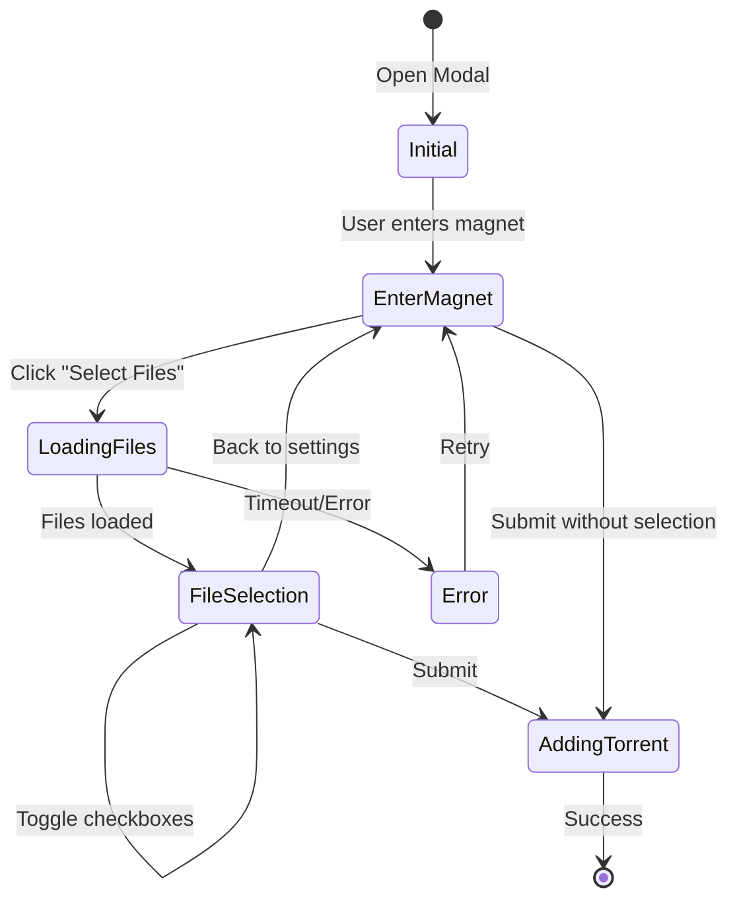
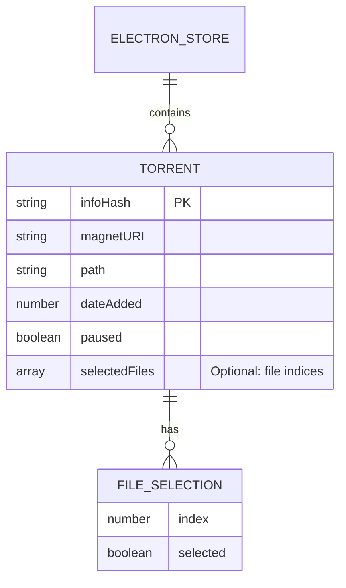

# Selective File Download Architecture

## System Flow Diagram



## Component Architecture



## Data Flow for File Selection



## File Selection State Management



## Storage Structure



## Key Interactions

### 1. Metadata Fetch
```
User → UI → Preload → Main → TorrentManager
TorrentManager: Creates temp WebTorrent → Gets metadata → Returns files
```

### 2. File Deselection
```
User selects files → Sends indices array → TorrentManager
For each file not in array: call file.deselect()
Result: 0KB placeholder files on disk
```

### 3. State Persistence
```
File selections → Saved to electron-store
On app restart → Torrent restored → File selections re-applied
```

## File System Result

When files are deselected:
```
download_folder/
├── selected_file_1.mp4      [1.5 GB] ✓ Downloaded
├── selected_file_2.txt      [2 KB]   ✓ Downloaded
├── deselected_file.mp4      [0 KB]   ✗ Placeholder
└── subfolder/
    ├── selected_file_3.srt  [45 KB]  ✓ Downloaded
    └── deselected_file.doc  [0 KB]   ✗ Placeholder
```

## Performance Considerations

1. **Metadata Fetch**: 5-30 seconds depending on peers
2. **File Deselection**: Instant (happens during torrent add)
3. **Memory**: Temporary client for metadata (~50MB)
4. **Disk**: 0KB files created instantly
5. **Network**: Only selected file pieces downloaded

## Security & Error Handling

- Timeout for metadata fetch (30s)
- Temporary client destroyed after use
- Invalid selections ignored gracefully
- State restored safely on errors
- No network activity for deselected files
